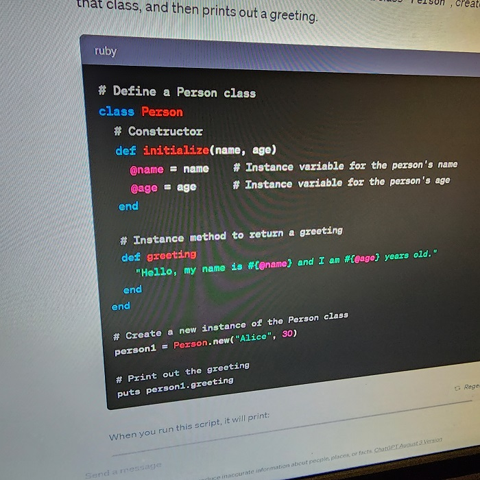
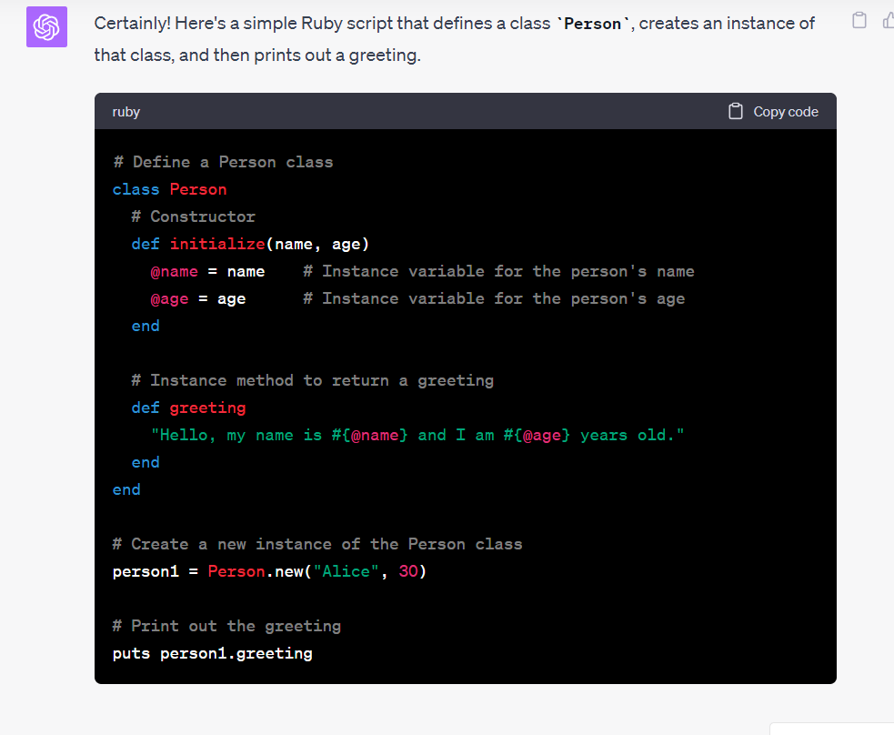

# Writing Good Documentation

## Step 1 - How to use Codeblocks

Codeblocks in markdown make it *very easy* for tech people to **copy, paste, share** code.
A good __Cloud Engineer__ uses Codeblocks whenever possible.

Because it allows others to copy and paste their code to replicate or research issues.


- In order to create codeblocks in markdown you need to use three backticks ( ` )
- Not to be confused with quotation ( ' )
  
```
# Define a Person class
class Person
  # Constructor
  def initialize(name, age)
    @name = name    # Instance variable for the person's name
    @age = age      # Instance variable for the person's age
  end

  # Instance method to return a greeting
  def greeting
    "Hello, my name is #{@name} and I am #{@age} years old."
  end
end
```

- When you can, you should attempt to apply syntax highlighting to your codeblocks

```ruby
# Define a Person class
class Person
  # Constructor
  def initialize(name, age)
    @name = name    # Instance variable for the person's name
    @age = age      # Instance variable for the person's age
  end

  # Instance method to return a greeting
  def greeting
    "Hello, my name is #{@name} and I am #{@age} years old."
  end
end
```

- Make note of where the backtick keyboard key is located.
- It should appear above the tab key.
- But it may vary based on your keyboard layout.


Good Cloud Engineers use codeblocks for both Code and Errors that appear in the console.


```bash
Traceback (most recent call last):
        2: from /usr/bin/irb:23:in `<main>'
        1: from (irb):1
RuntimeError: This is a custom error message
```

> Here is an example of using a codeblock for an error that appears in bash.


Always provide a codeblock instead of a screenshot when you can.
If you need to take a screenshot, make sure it is not a photo from your phone.

> There are certain cases where it is okay to take photos with your phone.  This is when you are showing something like a keyboard, which does not appear on a computer screen.  If it is rendered on your computer screen, it should be a screenshot.

## Step 2 - How to take Screenshots

A screenshot is when you capture a part of your screen from your laptop, desktop, or phone.

This is not to be confused with taking a photo with your phone. 

**DON'T DO THIS**

 

**DO THIS INSTEAD**

 

**To take screenshots on both macOS and Windows, you can use the following hotkeys:**

## For macOS:

**1. Entire Screen:**

- Press Command (⌘) + Shift + 3
- The screenshot will be saved to your desktop by default.
  
**2. Selected Portion:**

- Press Command (⌘) + Shift + 4
- Drag to select the area of the screen you want to capture.
- The screenshot will be saved to your desktop by default.

**3. Capture a Window:**

- Press Command (⌘) + Shift + 4, then press Spacebar.
- Click on the window you want to capture.
- The screenshot will be saved to your desktop by default.

**4. Capture Touch Bar (if you have one):**

- Press Command (⌘) + Shift + 6
- The screenshot will be saved to your desktop by default.

## For Windows:

**1. Entire Screen:**

- Press PrtScn (Print Screen) key.
- The screenshot is copied to the clipboard. You can paste it into an application like Paint or Word.

**2. Active Window:**

- Press Alt + PrtScn
- The screenshot of the active window is copied to the clipboard. You can paste it into an application.

  **3. Selected Portion using Snip & Sketch (available in recent Windows versions):**

- Press Windows + Shift + S
- Your screen will dim, and you can select an area to capture.
- The screenshot is copied to the clipboard. You can paste it into an application.

**4. Using Snipping Tool (available in older Windows versions):**

- Search for "Snipping Tool" in the start menu.
- Open the application and click on "New" to take a screenshot.
- Save the screenshot.

For both operating systems, there are also third-party applications available that offer more advanced screenshot functionalities, but the above methods are built-in and don't require additional software.
`


## Step 3 - Use Github Flavoured Task Lists 

Github extends Markdown to have a list where you can check off items. [<sup>.[1].<sup>](#external-references) 

- [x] Finish Step 1
- [ ] Finish Step 2
- [x] Finish Step 3

## Step 4 Use Emojis (Optional) 

Github Flavored Markdown (GFM) supports emoji shortcodes.
Here are some examples:

| Name | Shortcode |Emoji|
| --- | --- |---|
| Cloud | `:cloud:` | :cloud: |
| Cloud With Lightning | `:cloud_with_lightning:` | :cloud_with_lightning: | 

## Step 5 - How to create a table


You can use the following markdown format to create tables:

```md
| Name | Shortcode |Emoji|
| --- | --- |---|
| Cloud | `:cloud:` | :cloud: |
| Cloud With Lightning | `:cloud_with_lightning:` | :cloud_with_lightning: | 
```
Github extends the functionality of Markdown tables to provide more alignment and table cell formatting options. [<sup>.[2].<sup>](#external-references)

- Make note of where the pipe keyboard key is located.
- It should appear above the return or enter key.
- But it may vary based on your keyboard layout.
  


[Secret Window Hidden Garden](secret-window/hidden-garden.md) 


## External References

- [Basic writing and formatting syntax (GitHub Flavored Markdown)](https://docs.github.com/en/get-started/writing-on-github/getting-started-with-writing-and-formatting-on-github/basic-writing-and-formatting-syntax) 
- [GitHub Flavored Markdown Spec](https://github.github.com/gfm/)
- [GFM - Tasks Lists](https://docs.github.com/en/get-started/writing-on-github/getting-started-with-writing-and-formatting-on-github/basic-writing-and-formatting-syntax#task-lists) <sup>.[1].<sup>
- [GFM - Emoji Cheatsheet](https://github.com/ikatyang/emoji-cheat-sheet)
- [GFM - Tables (With extensions)](https://github.github.com/gfm/#tables-extension-) <sup>.[2].<sup> 

  


